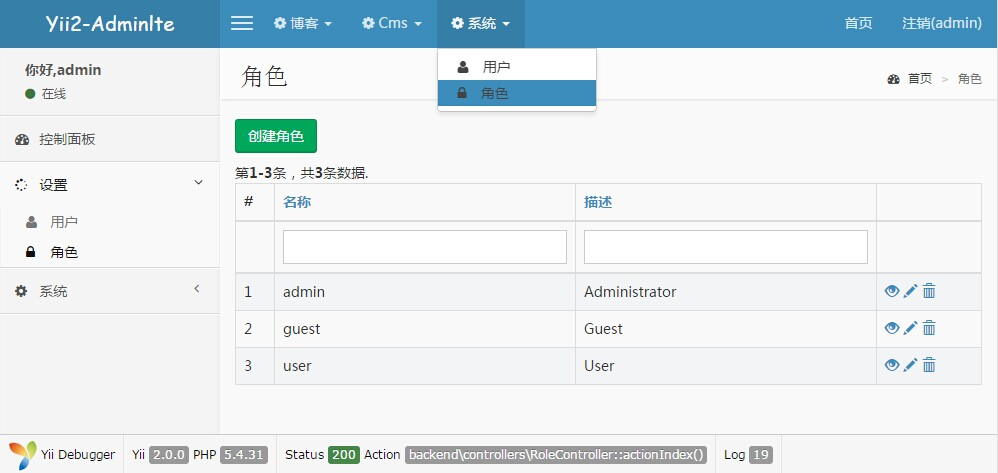

Yii2-Adminlte
==========

Backend user & password:
Login: `demo`
Password: `qwe1234`

Installation and getting started:
---------------------------------

If you do not have Composer, you may install it by following the instructions at getcomposer.org.

1. Run the following command: `php composer.phar create-project --prefer-dist --stability=dev funson86/yii2-adminlte yii2-adminlte` to install Yii2-Adminlte.
2. Run command: `cd /my/path/to/yii2-adminlte/` and go to main application directory.
3. Run command: `php requirements.php` and check the requirements.
4. Run command: `php init` to initialize the application with a specific environment.
5. Create a new database and adjust it configuration in `common/config/main-local.php` accordingly.
6. Run command: `php init` to apply migrations with console commands:
- m140608_201405_user_init : user table
- m140608_201406_rbac_init : rabc 4 tables of auth_assignment, auth_item, auth_item_child, auth_rule. same to yiisoft/yii2/rbac/migrations/schema-mysql.sql
- This will create tables needed for the application to work.
- You also can use database dump `db.sql` from `my/path/to/yii2-adminlte/tests/yii2-adminlte.sql`, but however I recommend to use migrations.

Usage
-----
- Use the URL `http://yii2-start.domain` to access application frontend.
- Use the URL `http://backend.yii2-start.domain` to access application backend.

Notes:
------

By default will be created one super admin user with login `admin` and password `qwe1234`, you can use this data to sing in application frontend and backend.

Themes:
-------
- Application backend it's based on "AdminLTE" template. More detail about this nice template you can find [here](http://www.bootstrapstage.com/admin-lte/).
- Application frontend it's based on "Flat Theme". More detail about this nice theme you can find [here](http://shapebootstrap.net/item/flat-theme-free-responsive-multipurpose-site-template/).

Preview:
-------
